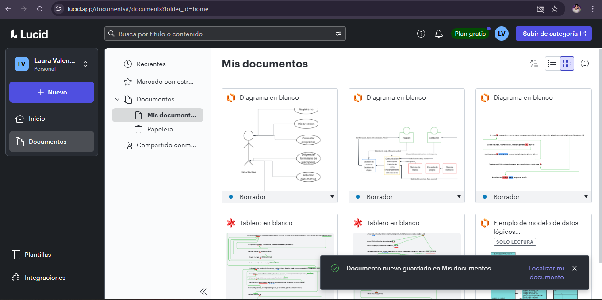
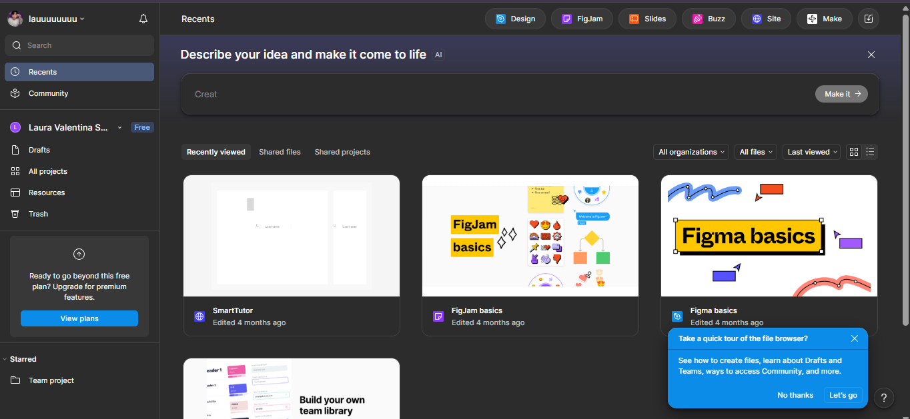
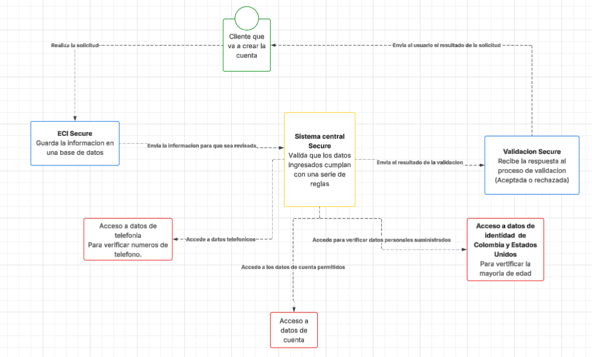

# DOSW_ParcialT1_LauraSantiago

Laura Valentina Santiago Marquez

**Evidencias plataformas**

# Diagrama de contexto

# Patrones de diseño

1. Chain of Reponsability

El tipo de este patron es de comportamiento.
Este patron puede aplicarse porque el proceso de lo que tenemos que hacer es una solicitud que hace el usuario, despues de realizar la solicitud
se pasa a la parte de validacion para poder verificar si se acepta la solicitud y se procesa o no se acepta y se le hace saber al usuario.

2. Builder

El tipo de patron es creacional
Necesitamso este patron porque al crear la solicitud le pedimos al usuario que ingrese sus datos personales. algunos datos son opcionales por ende 
no son necesarios de agregar.

# Requerimientos del sistema

**FUNCIONALES**

1. El sistema debe permitir al usuario realizar la solicitud.
2. El sistema debe realizar la verificacion de una o mas solicitudes.
3. El sistema debe permitir al usuario ingresar sus datos (Builder)

**NO FUNCIONALES**

4. El sistema debe te usar conexion
5. El sistema debe de proteger los datos de los usuarios.

# Diagrama de casos de uso

